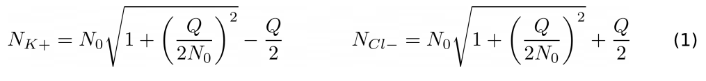

### The objectives

To record a large collection of “state-of-the-art” nucleosome trajectories:

1) Support experimental study by Chris Jaroniec on  15N relaxation in H4 histone tail (wild-type sequence vs. R3A mutant)
   . Aiming at JACS or similar.
2) Possibly write a methodological paper on “best practices” to simulate a nucleosome (idea by Alexei O.)
3) Open-ended. We can use these trajectories for whatever purposes. 
4) If successful, in future we may decide to collectively record more NCP trajectories to address new problems.

### 1. Construction of nucleosome model

The initial NCP coordinates were constructed based on the crystallographic structure PDB:3LZ0. The 3LZ0 structure has
the DNA and histone sequences that are essentially identical to the ones in the experimental sample used by Chris J. (
differs by 4 nucleotides and 1 amino acid). The histone tails that are missing from the crystallographic coordinates in
3LZ0 structure were rebuilt with extended conformations. For this purpose, we used the following multi-step protocol (
see Fig. 1):

1) clip histone tails from the original structure 3LZ0 according to H3:K39-R134, H4:N25, H2A:T16-K118, and H2B:
   E32-A121 (to "symmetrize" the pairs of histones)
2) generate free histone tails using the `sequence command` in `LEaP` (default settings (Φ,Ψ)=(-61°,-177°) for prolines
   and (Φ,Ψ)=(180°,180°) for all other amino acids)
3) rotate free histone tails to obtain (more realistic) extended conformations, (Φ,Ψ)=(‑60°,150°) (corresponding to PPII
   helix).
4) “glue” the free histone tails onto the body of the corresponding histone by superimposing N, Cα and C' atoms in the
   overlapping residues.
5) remove steric clashes between glued histone tails and surrounding nucleosomal DNA or histone cores. For this purpose,
   certain selected Φ and Ψ angles in rebuilt tails were set as in crystallographic structure with partial histone tail
   coordinates (PDB:1AOI). Those residues with adjusted Φ and Ψ are highlighted magenta in the plot below.

<figure>
  
</figure>
Figure 1. The protocol for preparing the initial coordinates of the NCP with full-length histone tails.
The histone core residues taken from the original structure 3LZ0 are colored green. 
The rebuilt histone tail residues are colored yellow. 
The Φ,Ψ-adjusted residues are colored magenta

### 2. MD setup

The NCP structure with linearly extended histone tails was protonated to match the experimental pH 7 using program
PDB2PQR [(Dolinsky T. J., et al. (2007))](https://www.ncbi.nlm.nih.gov/pmc/articles/PMC1933214/). The Na+ and Cl- ions
have been added to neutralize the system and to reproduce 100 mM NaCl.[^1] For Na+ and Cl- we used the default
Joung/Cheatham monovalent ion parameters
following [(Kolesnikov E.S., et al., (2021))](https://pubs.acs.org/doi/10.1021/acs.jctc.1c00332).[^2] To calculate the
number of ions to be added, we used the SLTCAP
method [(Schmit J. D., et al. (2018))](https://pubs.acs.org/doi/10.1021/acs.jctc.7b01254?ref=PDF):

  

In our case, the simulation box is large, N0 ≫Q, so that Eq. 1 leads to essentially the same results as (highly
intuitive) Eq. 2:

  

Nevertheless, we recommend using more rigorous Eq. 1 (to establish good practices in this area).

### 3. Force field / water model

| 
 **Force field** 
| 
 **Water model** 
 |                                                                                                                                            
 **Comments** 
                                                                                                                                            |
|:-----------------------------------------:|:------------------------------------------------:|:-----------------------------------------------------------------------------------------------------------------------------------------------------------------------------------------------------------------------------------------------------------------------------------------------------------------------------------:|
|               Amber ff99SB                |                       OPC                        |                                                                                        Developer’s choice using OPC to model both ordered and disordered systems [(Shabane P. S., et al. (2019))](https://pubmed.ncbi.nlm.nih.gov/30865832/)                                                                                        || Content Cell    | Content Cell    | Second Header |
|               Amber ff19SB                |                       OPC                        | Flagship combination recommended in Amber 22 manual to simulate folded proteins. Tests on unfolded proteins [(Abriata L. A., et al. (2021))](https://www.sciencedirect.com/science/article/pii/S2001037021001628), [(Pedersen K. B., et al. (2022))](https://onlinelibrary.wiley.com/doi/10.1002/prot.26409?af=R) have been limited |
|              Amber ff99-disp              |                     TIP4P-D                      |                                                                                   Developer’s choice using TIP4P-D to model both ordered and disordered systems [(Robustelli P. et al. (2018))](https://www.pnas.org/doi/10.1073/pnas.1800690115)                                                                                   |
|               Amber ff14SB                |                     TIP4P-D                      |                              Tested on histone tail and NCP specifically to model spin relaxation [(Kämpf K., et al., (2018))](https://www.sciencedirect.com/science/article/pii/S0006349518312815), [(Rabdano S. O., et al. (2021))](https://onlinelibrary.wiley.com/doi/abs/10.1002/anie.202012046)                               |

Table 1. Protein force field / water model combinations to be employed (equally and equitably) in the simulations. For
the nucleosomal DNA, we use ff99bsc1 force
field ([Ivani I., et al. (2016)](https://www.ncbi.nlm.nih.gov/pmc/articles/PMC4700514/))

### 4. Defining and re-defining the simulation box

***Note!** The solvated systems have already been prepared box.pdb (TIP4P-D water) box.pdb (OPC water). We suggest that
everyone uses these models as a starting point for their simulations (tails equilibration => re-solvation => production
run).*

*The shell scripts to execute these steps, together with a separate README file, have been deposited on our
github page:
https://github.com/OOLebedenko/nucleosome-md-simulation

<figure>
   
</figure>

Figure 2. The dimensions of simulation box before and after the equilibration of histone tails. 
The panel A illustrates the bigger initial box for initial simulation of the nucleosome with the 
fully extended histone tails (constructed via SolvateOct using the minimal separation of 12 Å 
between the NCP atoms and the boundary; structure box.pdb (TIP4P-D water)).[^3] The panel B 
illustrates the smaller box which is used for simulation of the nucleosome with collapsed 
histone tails after finishing the equilibration run (initial 100 ns). The dimensions of the
smaller box are fixed (L=84 Å, d=206 Å) and do not depend on the NCP coordinates following the 
equilibration run, see text for details; these dimensions are also identical for the OPC and 
TIP4P-D water models.

After 100-ns initial run, all tails adopted more compact conformations; at this point, the simulation is stopped and the
system is re-solvated using truncated octahedron box reduced by ca. 40% volume-wise (L=84 Å, d=206 Å). The reduced-size
box is shown in Fig. 2B.

This choice of box size is motivated by the previously recorded MD trajectories of the NCP totaling 41
μs ([Peng J., et al. (2021)](https://www.nature.com/articles/s41467-021-25568-6)). Specifically, we have re-analyzed the
trajectories by Peng et al. assuming different box sizes. We have found that the box size (L=84 Å, d=206 Å) ensures a
healthy separation between the master-copy NCP and its periodic images (no less than 12.9 Å).[^4],[^5] The re-solvation
procedure significantly reduces the size of the water box, thus increasing the speed of the simulation. At the same
time, it offers a good degree of confidence that NCP would not interact with its periodic images during the subsequent
production run.

### Simulation parameters

The re-solvated configuration is used to start the production run. During the simulations, the equations of motion are
integrated using the leapfrog algorithm with a time step of 2 fs.[^6] Bonds involving hydrogen atoms are constrained
using SHAKE algorithm. The non-bonded interactions are calculated with cutoff of 10.5 Å, as recommended for disordered
proteins ([Piana, S. K. et al. (2012)](https://journals.plos.org/plosone/article?id=10.1371/journal.pone.0039918)). Long-range interactions are treated using a particle-mesh Ewald
summation scheme with default parameters for grid spacing and spline interpolation. Constant pressure is maintained
using Berendsen barostat with relaxation time 2 ps. Bussi thermostat (also known as v-rescale thermostat) is used to
stabilize temperature at 25°C. The commonly used Langevin thermostat is not recommended for studying dynamics properties
of system. The reason is that the Langevin thermostat applies the random force to the system and interferes with the
actual motional modes (cf. this [Amber forum thread](http://archive.ambermd.org/201512/0039.html)
, [(Dunweg B., (1993))](https://aip.scitation.org/doi/10.1063/1.465444)). [^7]

[^1]: We used Na+ in accordance with the experimental practice (instead of the physiologically relevant K+)
[^2]: We choose not to use CUFIX since it has been parameterized with TIP3P water (advice by Alexey O.)
[^3]: Apparently, *SolvateOct* contains a bug – portions of the NCP are “sticking out” of the truncated octahedral box.
We are currently discussing this issue with David Case and have developed an alternative algorithm to resolve this
problem. However, in the context of this NCP simulation this does not matter whatsoever.
[^4]: The analysis has been performed with the stride of 10 ns.
[^5]: A similar analysis has also been performed for our own 2-μs trajectory of NCP in TIP4P-D water, showing even
greater separation from the periodic images.
[^6]: We decided not to use the Hydrogen Mass Repartitioning (HMR) algorithm with 4 fs integration step. This is because
HMR / 4 fs setup has never been tested with regard to spin relaxation calculations. We will run one trial trajectory
using HMR / 4 fs setup and let you know about the results.
[^7]: We have an extensive data (unpublished) showing that NPT-ensemble trajectories using Bussi thermostat produce spin
relaxation rates that are virtually identical to the NVE-ensemble trajectories. In contrast, NPT-ensemble trajectories
using Langevin thermostat produce spin relaxation rates that deviate strongly from the NVE results (e.g. by a factor of
2).

